<p align="center">
  
</p>

<h1 align="center">🏴 TGCTF - 天格CTF平台</h1>

<p align="center">
  <strong>✨ 一个现代化、功能完备的 CTF 竞赛平台 ✨</strong>
</p>

<p align="center">
  <a href="#-特性功能">特性</a> •
  <a href="#-技术栈">技术栈</a> •
  <a href="#-快速开始">快速开始</a> •
  <a href="#-项目结构">项目结构</a> •
  <a href="#%EF%B8%8F-配置说明">配置</a> •
  <a href="#-作者">作者</a>
</p>

<p align="center">
  
  
  
  
  
</p>

---

## 🎯 项目简介

**TGCTF（天格CTF）** 是一个功能完善的 CTF（Capture The Flag）网络安全竞赛平台，支持 **Jeopardy 解题赛** 和 **AWD-F 攻防修复赛** 两种比赛模式。

平台专为网络安全竞赛设计，具备完整的比赛管理、题目管理、队伍管理、Docker 动态靶机、防作弊检测和实时大屏监控等功能。

```
  ████████╗ ██████╗  ██████╗████████╗███████╗
  ╚══██╔══╝██╔════╝ ██╔════╝╚══██╔══╝██╔════╝
     ██║   ██║  ███╗██║        ██║   █████╗  
     ██║   ██║   ██║██║        ██║   ██╔══╝  
     ██║   ╚██████╔╝╚██████╗   ██║   ██║     
     ╚═╝    ╚═════╝  ╚═════╝   ╚═╝   ╚═╝     
                    天格CTF平台
```

---

## 🌟 特性功能

### 🎮 比赛模式

| 模式 | 描述 |
|------|------|
| 🧩 **Jeopardy** | 传统解题赛，选手解题获取 Flag 提交得分 |
| ⚔️ **AWD-F** | 攻防修复赛，选手防守自己的靶机并修复漏洞 |

### 🛠️ 核心功能

<table>
<tr>
<td width="50%">

**📋 比赛管理**
- 🎯 多比赛同时运行
- ⏰ 自动状态切换（pending → running → ended）
- 🏆 一二三血奖励配置
- 📢 比赛公告系统
- 🔒 组织隔离与队伍审核

</td>
<td width="50%">

**📝 题目系统**
- 📚 题库管理，跨比赛复用
- 🏷️ 多类别支持（WEB/PWN/REVERSE/CRYPTO/MISC...）
- 📊 动态计分模型
- ⏱️ 定时放题
- 💡 多提示支持

</td>
</tr>
<tr>
<td width="50%">

**🐳 Docker 容器**
- 🚀 动态靶机一键启动
- 🔄 队伍独立 Flag
- ⏳ TTL 自动销毁与续期
- 📦 端口池管理
- 🔧 资源限制（CPU/内存）

</td>
<td width="50%">

**🔍 防作弊系统**
- 🌐 同 IP 异常检测
- 🚨 Flag 共享检测
- 📡 实时 WebSocket 推送
- 🔒 自动封禁机制
- 📊 IP 轨迹追踪

</td>
</tr>
<tr>
<td width="50%">

**📊 排行榜 & 大屏**
- 🥇 实时排行榜
- 📈 分数趋势图
- 🖥️ 比赛大屏监控
- 🩸 一二三血公告
- 🔄 WebSocket 实时更新

</td>
<td width="50%">

**⚔️ AWD-F 专属**
- 🛡️ 补丁上传与验证
- 🔥 EXP 自动攻击调度
- 📊 防守得分统计
- 🔄 容器重置功能
- ⏱️ 全局攻击倒计时

</td>
</tr>
</table>

---

## 🛡️ 技术栈

<table>
<tr>
<td align="center" width="96">

<br><strong>Go 1.23</strong>
</td>
<td align="center" width="96">

<br><strong>Gin</strong>
</td>
<td align="center" width="96">

<br><strong>PostgreSQL 16</strong>
</td>
<td align="center" width="96">

<br><strong>Docker</strong>
</td>
<td align="center" width="96">

<br><strong>JWT</strong>
</td>
</tr>
</table>

**后端**
- 🔧 **Go 1.23** - 高性能后端语言
- 🌐 **Gin** - 轻量级 Web 框架
- 🗃️ **pgx** - PostgreSQL 驱动
- 🔐 **golang-jwt** - JWT 认证
- 🔒 **bcrypt** - 密码加密

**数据库**
- 💾 **PostgreSQL 16** - 主数据库

**容器化**
- 🐳 **Docker** - 动态靶机容器
- 🐙 **Docker Compose** - 服务编排

**前端**
- 🎨 **Tailwind CSS** - 原子化 CSS 框架
- ⚡ **Alpine.js** - 轻量级 JS 框架
- 📡 **WebSocket** - 实时通信

---

## 🚀 快速开始

### 📋 前置要求

- Docker & Docker Compose
- Git

### ⚡ 一键部署

```bash
# 1. 克隆仓库
git clone https://github.com/NUDTTAN91/TGCTF.git
cd TGCTF

# 2. 修改配置（可选）
vim docker-compose.yml

# 3. 启动服务
docker-compose up -d

# 4. 访问平台
# 前台: http://localhost:8081
# 后台: http://localhost:8081/admin/admin.html
```

### 🔑 默认账号

> ⚠️ **生产环境请务必修改默认密码！**

| 账号 | 密码 | 说明 |
|------|------|------|
| `root` | `root` | 超级管理员（请修改） |

---

## 📁 项目结构

```
TGCTF/
├── 📂 server/                # 后端代码
│   ├── 📂 admin/             # 管理员相关接口
│   │   ├── anti_cheat.go     # 🔍 防作弊系统
│   │   ├── organization.go   # 🏢 组织管理
│   │   ├── settings.go       # ⚙️ 系统设置
│   │   ├── team.go           # 👥 队伍管理
│   │   └── user.go           # 👤 用户管理
│   ├── 📂 awdf/              # AWD-F 模式
│   │   ├── container.go      # 🐳 容器管理
│   │   ├── exp.go            # 💥 EXP 执行
│   │   ├── patch.go          # 🔧 补丁系统
│   │   └── scheduler.go      # ⏰ 攻击调度器
│   ├── 📂 contest/           # 比赛管理
│   ├── 📂 docker/            # Docker 容器管理
│   ├── 📂 question/          # 题目管理
│   ├── 📂 submission/        # Flag 提交与计分
│   ├── 📂 monitor/           # 大屏监控
│   ├── 📂 logs/              # 系统日志
│   ├── main.go               # 🚀 入口文件
│   ├── auth.go               # 🔐 认证
│   └── middleware.go         # 🔗 中间件
├── 📂 web/                   # 前端代码
│   ├── 📂 admin/             # 管理后台页面
│   └── *.html                # 用户端页面
├── 📂 data/                  # 数据目录
│   ├── 📂 postgres/          # PostgreSQL 数据
│   ├── 📂 uploads/           # 上传文件
│   └── 📂 attachments/       # 题目附件
├── 🐳 Dockerfile             # Docker 镜像构建
├── 🐙 docker-compose.yml     # 服务编排
├── 📜 init.sql               # 数据库初始化
├── 📦 go.mod                 # Go 依赖
└── 📖 README.md              # 本文档
```

---

## ⚙️ 配置说明

### 🔧 环境变量

| 变量名 | 默认值 | 说明 |
|--------|--------|------|
| `DATABASE_URL` | - | PostgreSQL 连接串 |
| `JWT_SECRET` | `change-this-secret` | JWT 签名密钥 |
| `ADMIN_USERNAME` | `root` | 超级管理员用户名 |
| `ADMIN_PASSWORD` | - | 超级管理员密码 |
| `SERVER_PORT` | `80` | 服务端口 |

### 📝 docker-compose.yml 示例

```yaml
services:
  db:
    image: postgres:16-alpine
    environment:
      POSTGRES_DB: tgctf
      POSTGRES_USER: tgctf
      POSTGRES_PASSWORD: your-strong-password

  app:
    build: .
    environment:
      DATABASE_URL: postgres://tgctf:your-strong-password@db:5432/tgctf
      JWT_SECRET: "your-jwt-secret-key"
      ADMIN_USERNAME: admin
      ADMIN_PASSWORD: "your-admin-password"
    ports:
      - "8081:80"
    volumes:
      - /var/run/docker.sock:/var/run/docker.sock:ro
```

---

## 📊 系统架构

```
┌─────────────────────────────────────────────────────────────┐
│                        用户浏览器                            │
└─────────────────┬───────────────────────────────────────────┘
                  │ HTTP/WebSocket
┌─────────────────▼───────────────────────────────────────────┐
│                    TGCTF 应用服务器                          │
│  ┌─────────────────────────────────────────────────────┐   │
│  │  Gin Web Framework                                   │   │
│  │  ├── API Routes (/api/*)                            │   │
│  │  ├── Admin Routes (/api/admin/*)                    │   │
│  │  └── Static Files (web/*)                           │   │
│  └─────────────────────────────────────────────────────┘   │
│  ┌──────────┐ ┌──────────┐ ┌──────────┐ ┌──────────┐       │
│  │ 比赛管理  │ │ 题目系统  │ │ Docker   │ │ 防作弊   │       │
│  │  Module  │ │  Module  │ │  Module  │ │  Module  │       │
│  └──────────┘ └──────────┘ └──────────┘ └──────────┘       │
└───────┬─────────────────────────────┬───────────────────────┘
        │                             │
┌───────▼───────┐           ┌─────────▼─────────┐
│  PostgreSQL   │           │   Docker Engine   │
│    Database   │           │   (动态靶机容器)   │
└───────────────┘           └───────────────────┘
```

---

## 🎨 界面预览

> 💡 平台采用深色主题设计，橙黑配色，科技感十足！

**特色界面**
- 🏠 首页 - 赛博朋克风格的欢迎页
- 🔐 登录/注册 - 极简设计，快速上手
- 🎮 比赛题目 - 卡片式布局，分类清晰
- 📊 排行榜 - 实时更新，一二三血标记
- 🖥️ 大屏监控 - 比赛实时动态展示
- ⚙️ 管理后台 - 功能完备的管理界面

---

## 📈 动态计分模型

TGCTF 采用 **指数衰减动态计分** 模型：

```
S(N) = Smin + (Smax - Smin) × e^(-(N-1)/(10×D))

其中：
- S(N)  = 当前分值
- Smax  = 初始分数
- Smin  = 最低分数
- N     = 已解出队伍数
- D     = 难度系数 (1-10)
```

**血量奖励**（可配置）：
- 🩸 一血：基础分 +5%
- 🩸 二血：基础分 +3%
- 🩸 三血：基础分 +1%

---

## 🤝 贡献指南

欢迎提交 Issue 和 Pull Request！

1. Fork 本仓库
2. 创建特性分支 (`git checkout -b feature/AmazingFeature`)
3. 提交更改 (`git commit -m 'Add some AmazingFeature'`)
4. 推送到分支 (`git push origin feature/AmazingFeature`)
5. 开启 Pull Request

---

## 📄 开源协议

本项目采用 **AGPL-3.0 License** 开源协议。

> ⚠️ 如果你修改了本项目并通过网络提供服务，你必须公开你的修改后的源代码。

详见 [LICENSE](LICENSE) 文件。

---

## 👨‍💻 作者

<table>
<tr>
<td align="center">
<a href="https://github.com/NUDTTAN91">

<br />
<sub><b>tan91</b></sub>
</a>
<br />
<a href="https://github.com/NUDTTAN91" title="GitHub">🐙 GitHub</a>
<br />
<a href="https://blog.csdn.net/ZXW_NUDT" title="Blog">📝 CSDN</a>
</td>
</tr>
</table>

---

<p align="center">
  <strong>Made with ❤️ by tan91</strong>
</p>

<p align="center">
  Copyright © 2021-present tan91. All Rights Reserved.
</p>

---

## 📸 项目截图

<details>
<summary>🏠 <b>首页 & 登录</b></summary>
<br>

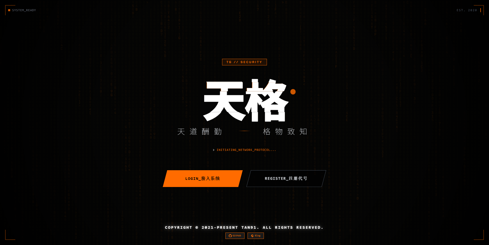

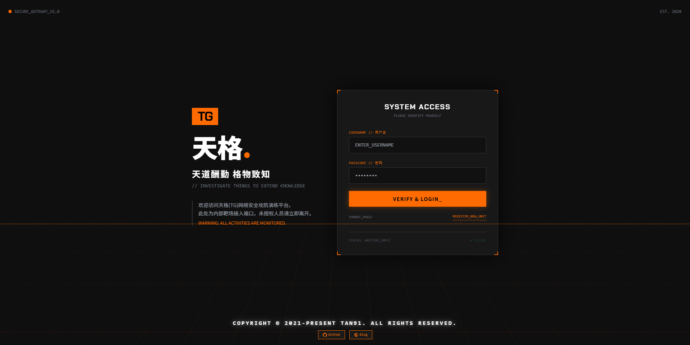

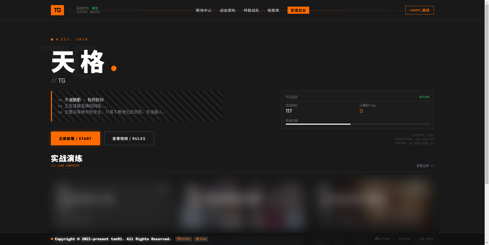

</details>

<details>
<summary>🎯 <b>比赛界面</b></summary>
<br>

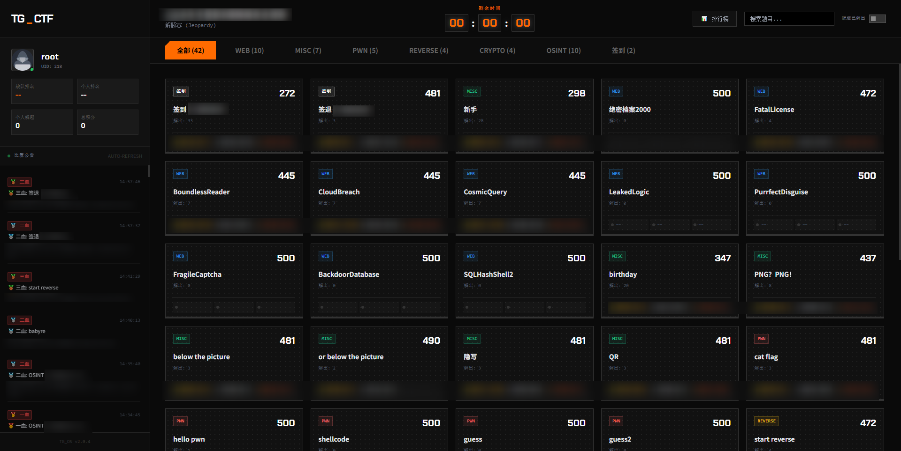

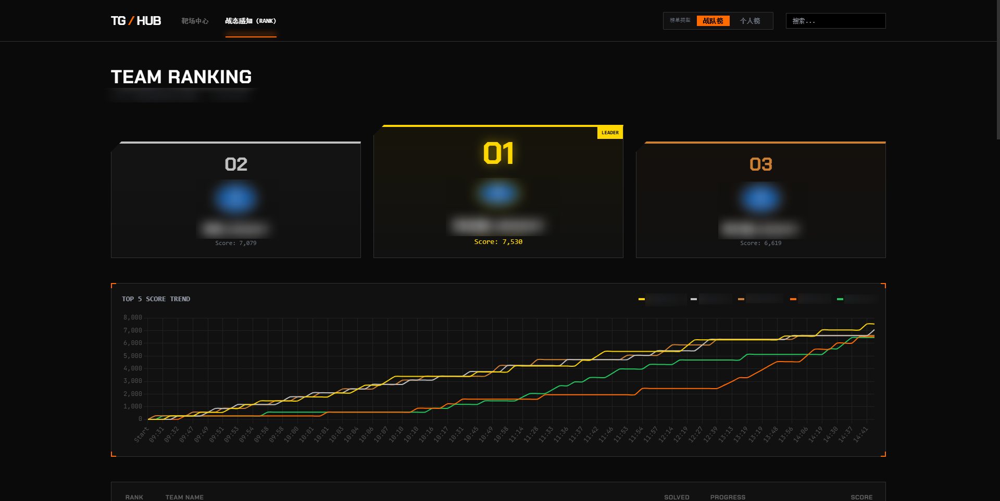

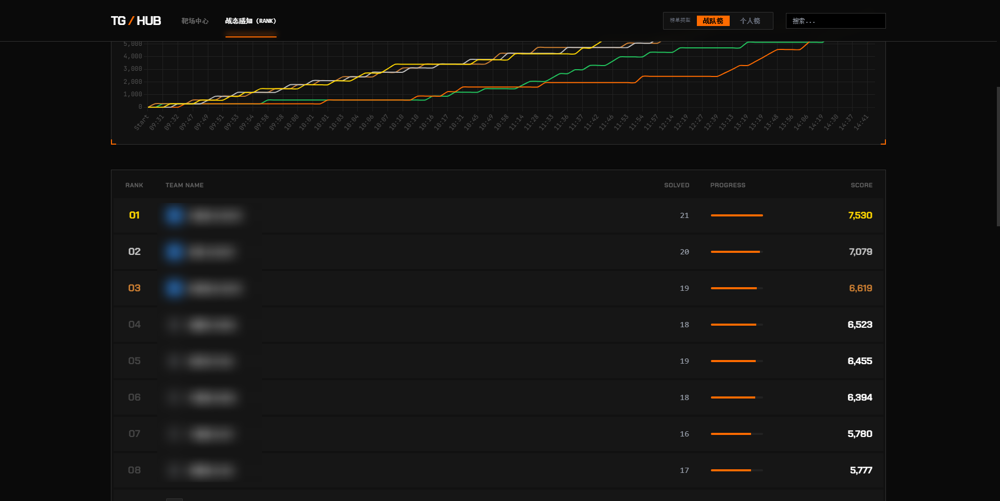

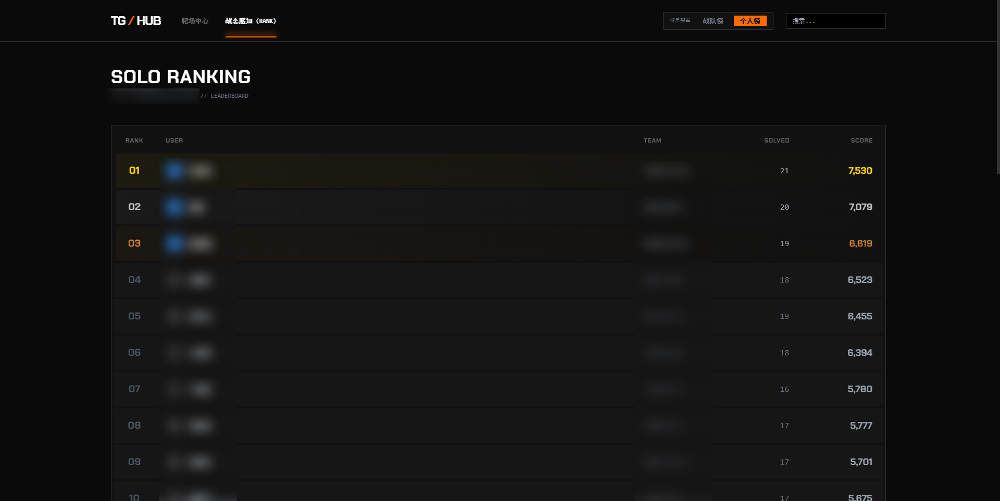

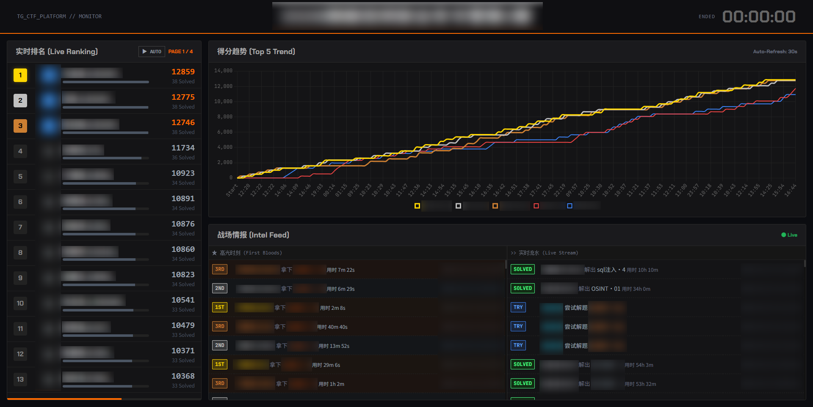

</details>

<details>
<summary>⚔️ <b>AWD-F 攻防模式</b></summary>
<br>

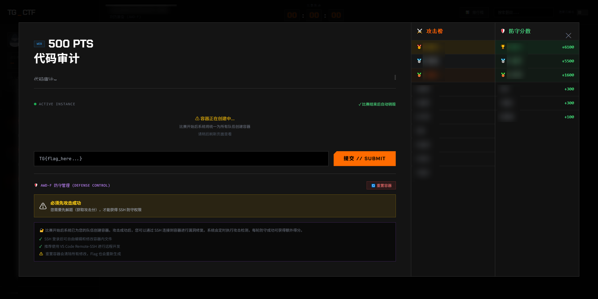

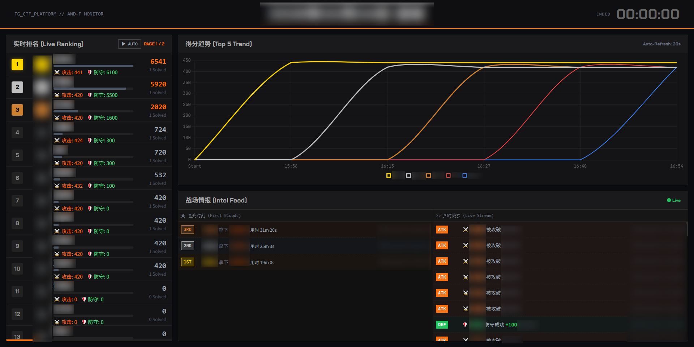

</details>

<details>
<summary>🛠️ <b>管理后台</b></summary>
<br>

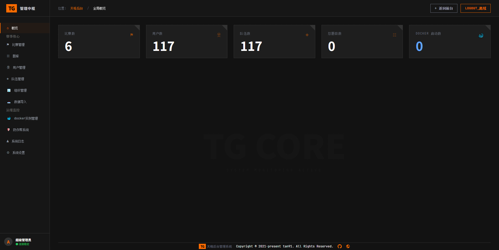

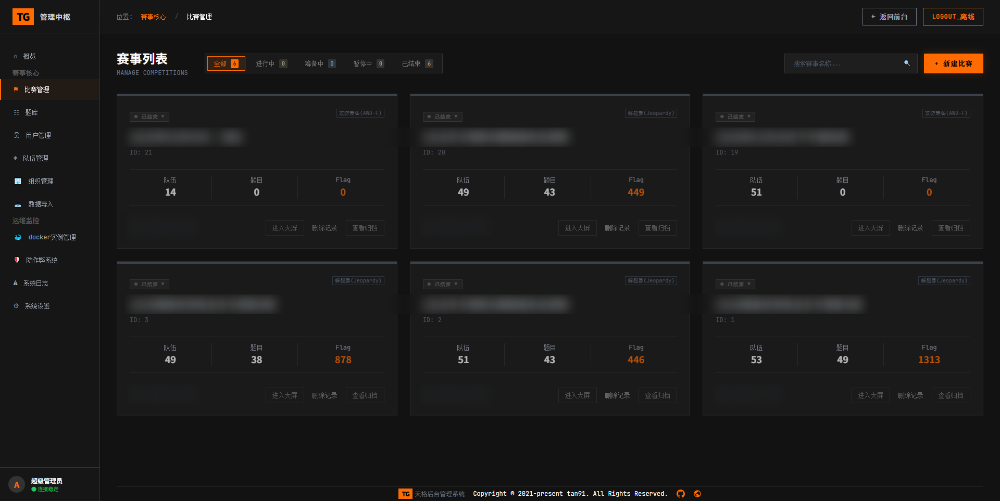

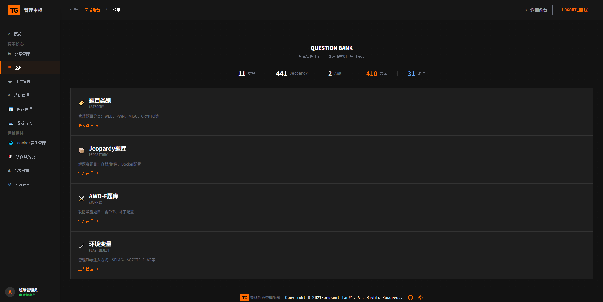

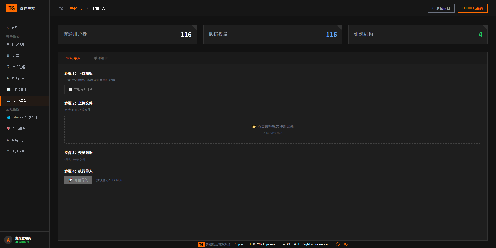

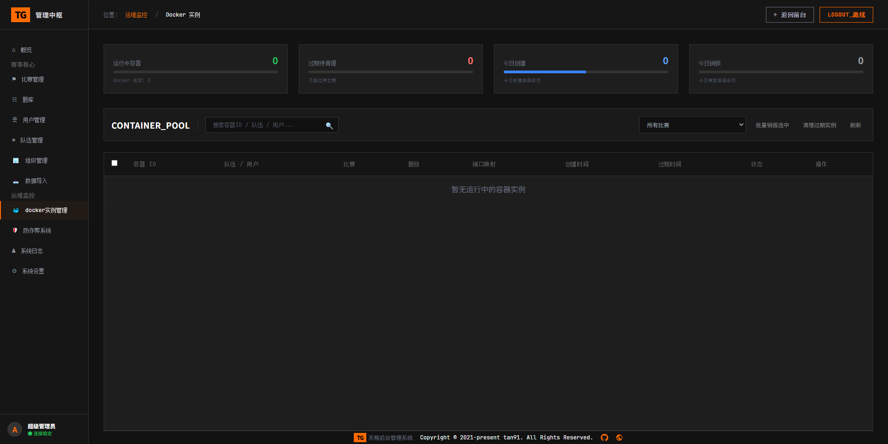

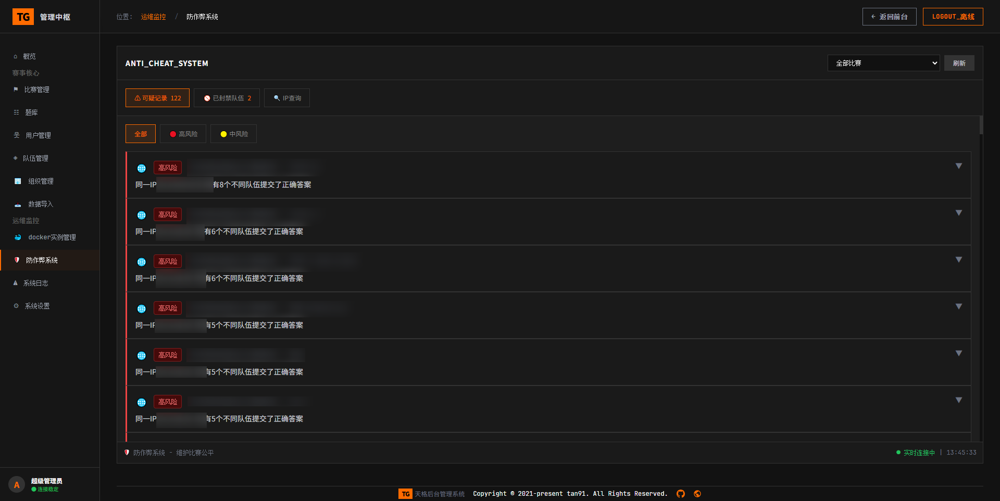

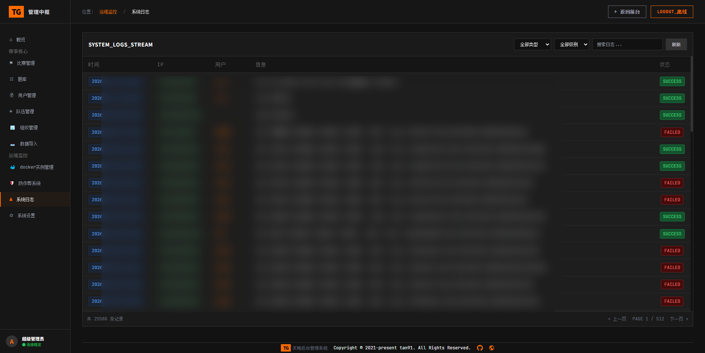


</details>

---

<p align="center">
  ⭐ 如果觉得这个项目对你有帮助，请给一个 Star 吧！⭐
</p>

```
     _____  ____   ____ _____ _____ 
    |_   _|/ ___| / ___|_   _|  ___|
      | | | |  _ | |     | | | |_   
      | | | |_| || |___  | | |  _|  
      |_|  \____| \____| |_| |_|    
                                    
         ヾ(◍°∇°◍)ﾉﾞ 天格CTF
```
